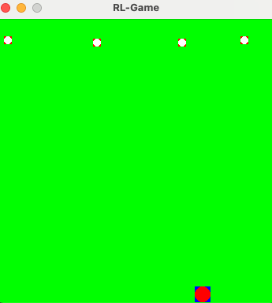
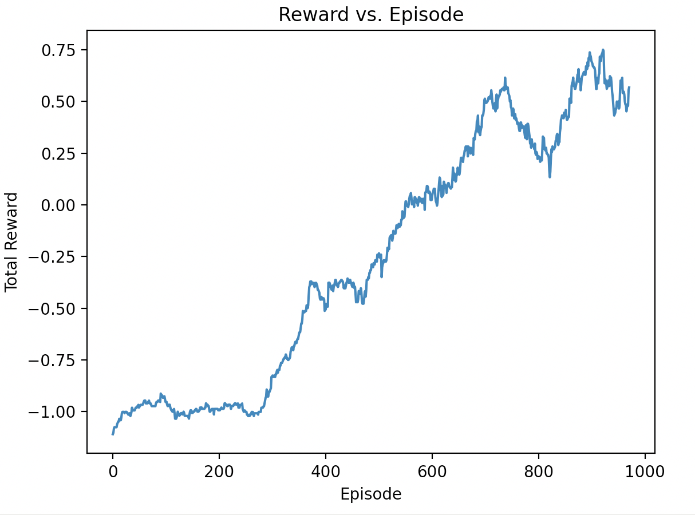
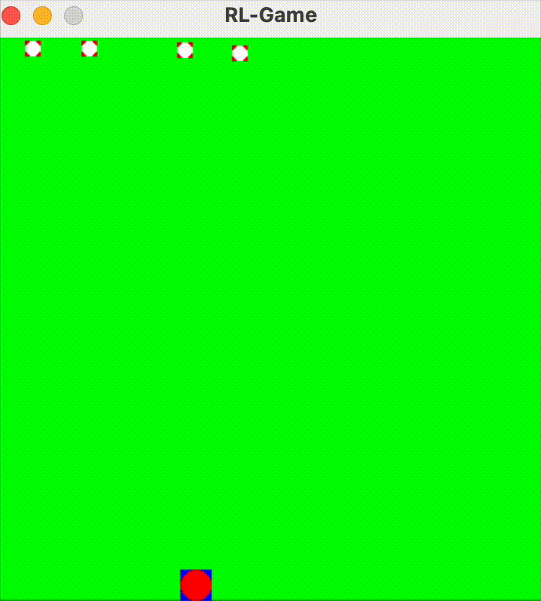
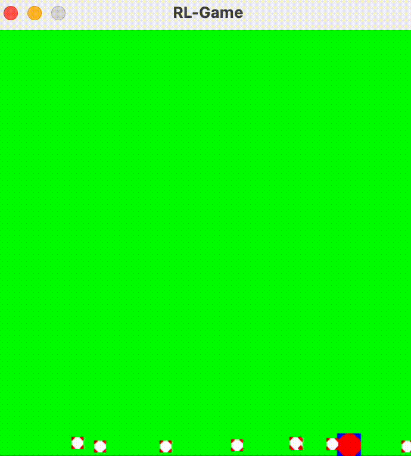

<h1 align="center">Mini RL Game — DQN learns to Eat or Avoid</h1>

Pygame-based mini-game with a Deep Q-Learning (DQN) agent that learns two scenarios:

- Eat: catch falling objects.
- Avoid: survive by dodging falling objects.

It supports two observation types: a compact vector state (default - MLP) and raw pixels via a CNN.

  

The player (blue-red) moves left/right along the bottom. In Eat, it tries to catch falling objects; in Avoid, it dodges them while they fall from the top.

  

<em>Reward grows episodically with vector observations</em>

## Videos 

  
  
   
  <em>Left: Eat — Right: Avoid</em>
   
  <small>Original videos: <code>assets/game_record_eat.mov</code> and <code>assets/game_record_avoid.mov</code></small>
  

---

## Features

- DQN with target network (soft updates) and Huber loss (Keras/TensorFlow).
- Experience replay with warm-up, large buffer, and batched updates.
- Linear epsilon schedule per episode; reproducible seeds.
- Vector or CNN observations (84×84×4 stacked grayscale frames).
- Headless mode to train faster; scenario-aware model saving and plotting.

## Installation

Create a Conda environment, then install TensorFlow for your platform.

- Create environment: `conda env create -f environment.yml`
- Activate: `conda activate rl-game`

## Quick Start

Train (vector, default):

- Eat: `python main.py --scenario eat --train --num-enemies 3 --enemy-speed 3 --headless`
- Avoid: `python main.py --scenario avoid --train --num-enemies 3 --enemy-speed 6 --headless`

Useful flags:

- Step cap per episode: `--max-steps 2000`
- Reproducible runs: `--seed 42`
- Headless (no window): `--headless`
- Observation type: `--obs-type {vector|pixels}`

Examples:

- Vector: `python main.py --scenario eat --train --num-enemies 4 --enemy-speed 5 --max-steps 2000 --seed 42 --headless`
- Pixels: `python main.py --scenario eat --train --obs-type pixels --num-enemies 4 --enemy-speed 5 --max-steps 2000 --seed 42 --headless`

Evaluate a trained model (no exploration):

- Vector: `python main.py --scenario eat`
- Pixels: `python main.py --scenario eat --obs-type pixels`

Models are saved every 10 episodes (by obs type and scenario):

- Vector: `model/model_vector_eat.h5`, `model/model_vector_avoid.h5`
- Pixels: `model/model_pixels_eat.h5`, `model/model_pixels_avoid.h5`

## Pretrained Models

Skip training and download pretrained weights from Hugging Face:

- https://huggingface.co/turhancan97/mini-game-rl-models

Place the downloaded files under the `model/` folder using these names:

- Vector: `model/model_vector_eat.h5`, `model/model_vector_avoid.h5`
- Pixels: `model/model_pixels_eat.h5`, `model/model_pixels_avoid.h5`

Then run evaluation:

- Vector: `python main.py --scenario eat --num-enemies 4`
- Pixels: `python main.py --scenario eat --num-enemies 4 --obs-type pixels`

## Plot Training

Analyze rewards and Q-values. For vector observations the script also produces state–Q heatmaps and 3D surfaces.

- Vector: `python plot.py --scenario eat --obs-type vector`
- Pixels: `python plot.py --scenario eat --obs-type pixels`

Reads:

- Vector: `plot/reward_history_vector_<scenario>.pickle`, `plot/q_values_vector_<scenario>.pickle`
- Pixels: `plot/reward_history_pixels_<scenario>.pickle`, `plot/q_values_pixels_<scenario>.pickle`

Note: With `--obs-type pixels`, state-based plots are skipped since there is no compact state vector.

## Contributing

Pull requests are welcome. For major changes, please open an issue first to discuss what you would like to change.

## Acknowledgements

- Built with Pygame and TensorFlow/Keras.
- CNN design follows common Atari DQN practice.
